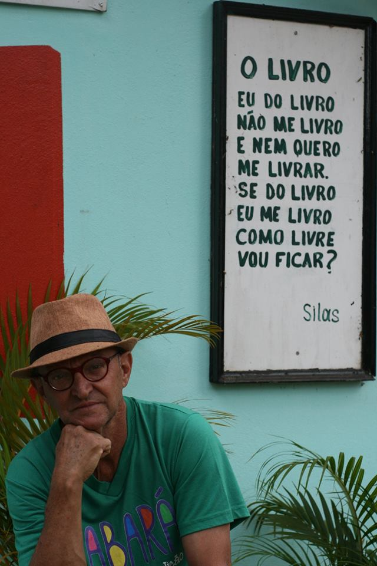

Este ano, o CLBA 2019 recebe com muito carinho
*Silas da Fonseca*, poeta popular, contador de histórias,
músico e educador de Sabará, MG.

## Sobre o Autor

Silas da Fonseca é poeta, contador de histórias e músico. Natural de Jaboticatubas / MG, vive no Pompéu, em Sabará / MG, desde criança. Tem dois livros editados – "Alma, verso e coração" (poesia) e "O Pompéu do Ora pro nobis em prosa e poesia" (“causos”) –   mais de seiscentos textos no Recanto das Letras, contando com mais de oitenta mil leituras, e cordéis. Ao lado do músico José Alves, criou o grupo Cantarolê e gravou dois CDs de músicas educativas. Atualmente conduz o projeto Rancho da Cultura, que recebe mais de três mil crianças todo ano, para atividades de incentivo à leitura e preservação ambiental.

    

        
    

    

        
    

    

        
    

    

        
    

    

        
    

## Inscrições

Na edição deste ano, não é necessário fazer inscrição.
É só vir e participar!
Aos que precisarem, certificados impressos serão
oferecidos ao final do evento.

### Endereço do evento

<address>
Instituto Federal de Minas Gerais (IFMG) 
Rodovia MGC-262 km 10, Sobradinho, Sabará/MG. 
Contato: (31) 3674-1178
</address>